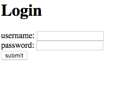
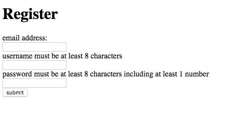
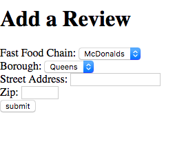
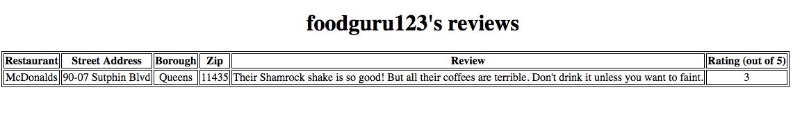
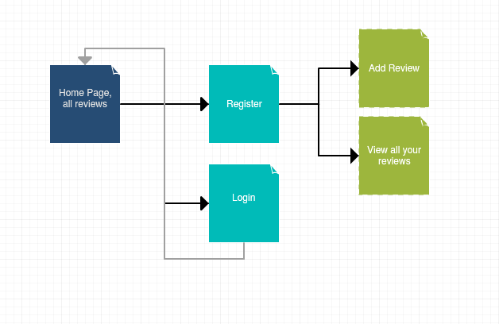

The content below is an example project proposal / requirements document. Replace the text below the lines marked "__TODO__" with details specific to your project. Remove the "TODO" lines.

(___TODO__: a brief one or two paragraph, high-level description of your project)
Fast Food Reviews

## Overview

This app will allow users to look for a location of a popular fast food chain in NYC. The person will be able to
see reviews on that location, which can help them decide what to order or if they would rather go to another location.
Users can register, log in, make a review, filter reviews, and view their own reviews. 

## Data Model

(___TODO__: a description of your application's data and their relationships to each other_) 

The application will store Users and Reviews. A User object will contain an array of reviews. A
review will contain a reference to the user id. 

(___TODO__: sample documents_)

An example User
```
{username:	"foodguru123"
 password:  //a salted and hashed password 
 reviews: //array of references to Review documents
}
```
An example Review

```
{storeName: "McDonalds"
 review: "Don't drink their coffee unless you want to feel sick"
 rating: 3 (out of 5)
 username: foodguru123
 streetAddress: "90-07 Sutphin Blvd"
 borough: "Queens"
 zip: "11435"
 state: "NY"
 }

```

## [Link to Commented First Draft Schema](db.js) 

(___TODO__: create a first draft of your Schemas in db.js and link to it_)


## Wireframes

(___TODO__: wireframes for all of the pages on your site; they can be as simple as photos of drawings or you can use a tool like Balsamiq, Omnigraffle, etc._)


/ - home page than has login, register, all the reviews, and allows user to filter reviews

 
/login - allows users to login



/register - form for creating an account



/review/add - form for adding a review



/review/slug - page for showing user reviews


## Site map

(___TODO__: draw out a site map that shows how pages are related to each other_)


Here's a [complex example from wikipedia](https://upload.wikimedia.org/wikipedia/commons/2/20/Sitemap_google.jpg), but you can create one without the screenshots, drop shadows, etc. ... just names of pages and where they flow to.

## User Stories or Use Cases

(___TODO__: write out how your application will be used through [user stories](http://en.wikipedia.org/wiki/User_story#Format) and / or [use cases](https://www.mongodb.com/download-center?jmp=docs&_ga=1.47552679.1838903181.1489282706#previous)_)

1. as non-registered user, I can search for reviews of restaurants and register a new account with the site
2. as a user, I can log in to the site
3. as a user, I can create a new review
4. as a user, I can view all of my reviews

## Research Topics

(___TODO__: the research topics that you're planning on working on along with their point values... and the total points of research topics listed_)

* (5 points) Automated functional testing for all of your routes:
	* I will use selenium or headless chrome to test my routes. Headless chrome can run without having the
	memory overhead of running an actual Chrome browser. I will use it because it eliminates the need 
	to open my browser and manually go to web pages to test them out. 
* (3 points) Unit testing with Javascript (Mocha) OR client-side Javascript library (JQuery)
	* I will use this to test whether my login and register functions work properly. 
	* The cases include logging in with incorrect username and/or password, logging in with correct username/password.
	* Other cases include registering with a valid password and invalid password. 
	
	* JQuery abstracts html from javascript and wraps Javascript codes into methods. I would use it to help
	* with form validation. For example, if the user forgets to enter a field, that field can be highlighted to
	* make it easy to see what information is missing. 

8 points total out of 8 required points (___TODO__: addtional points will __not__ count for extra credit_)


## [Link to Initial Main Project File](app.js) 

(___TODO__: create a skeleton Express application with a package.json, app.js, views folder, etc. ... and link to your initial app.js_)

## Annotations / References Used

(___TODO__: list any tutorials/references/etc. that you've based your code off of_)

1. [passport.js authentication docs](http://passportjs.org/docs) - (add link to source code that was based on this)
2. [tutorial on vue.js](https://vuejs.org/v2/guide/) - (add link to source code that was based on this)
